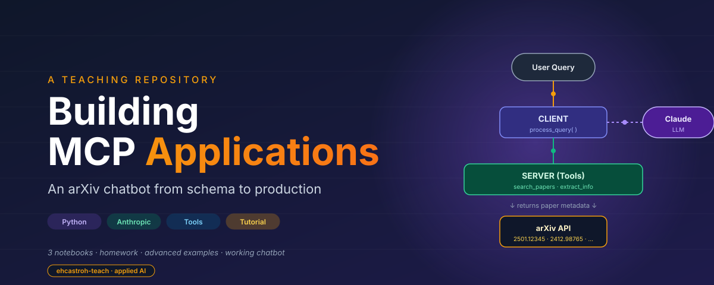

<div align="center">
  
</div>

# Building MCP Applications: An ArXiv Chatbot

This repository teaches you how to build applications where large language models can call external tools. Using the Model Context Protocol (MCP) pattern - schemas the model can read, a dispatcher that routes tool requests, and a client loop that threads results back into the conversation - you will implement a working chatbot that searches arXiv for research papers and retrieves their metadata. Every design decision from schema wording to loop termination is covered in three lesson notebooks, three paired homework notebooks, four production-shaped examples, and a runnable `arxiv_chatbot.py`.

---

## Learning Objectives

By the end of this material, you will be able to:

- Define Python functions with the signatures and error semantics that make them useful as LLM tools
- Write JSON schemas that describe tool inputs so the model calls them correctly
- Build a dispatcher that maps schema requests to Python callables and normalizes return values for the model
- Route model responses that mix text and tool_use content blocks
- Manage conversation state across multi-turn tool loops
- Extend a running MCP application with new tools without modifying the client loop
- Choose between deployment shapes: CLI, web API, async, streaming, self-reflection

---

## File Dictionary

| File | Type | Description |
|------|------|-------------|
| `01_building_mcp_servers.ipynb` | Notebook | Lesson 1 - tool functions, schemas, dispatcher, execution and testing |
| `02_building_mcp_clients.ipynb` | Notebook | Lesson 2 - client initialization, message routing, state management, interactive loop |
| `03_mcp_in_practice.ipynb` | Notebook | Lesson 3 - end-to-end architecture, message-flow traces, tool design, deployment patterns |
| `homework/building_mcp_servers_homework.ipynb` | Notebook | Practice writing tools, schemas, and a dispatcher on an offline dataset |
| `homework/building_mcp_clients_homework.ipynb` | Notebook | Practice response classification, message construction, and loop termination against mocked responses |
| `homework/mcp_in_practice_homework.ipynb` | Notebook | Capstone - design and build your own MCP application in a new domain |
| `arxiv_chatbot.py` | Script | The reference implementation - server, client, and terminal user layer in one file |
| `examples/async_arxiv_chatbot.py` | Script | Concurrent tool execution with asyncio |
| `examples/streaming_arxiv_chatbot.py` | Script | Token-by-token response streaming |
| `examples/fastapi_arxiv_server.py` | Script | Per-session web API around the same tools |
| `examples/multi_tool_reflection.py` | Script | Self-critique loop for higher-quality answers |
| `images/` | Directory | Architecture and flow diagrams used in the notebooks |
| `papers/` | Directory | Persisted paper metadata generated by `search_papers` at runtime |
| `requirements.txt` | Text | Python dependencies |

---

## Workflow

```
  Clone repo
      |
      v
  Install dependencies (requirements.txt)
      |
      v
  Open 01_building_mcp_servers.ipynb
      |
      +---> Learn tool functions, schemas, dispatcher
      |
  Open 02_building_mcp_clients.ipynb
      |
      +---> Learn client init, response routing, state, loop
      |
  Open 03_mcp_in_practice.ipynb
      |
      +---> See the full architecture, message flows, deployment options
      |
      v
  Work through paired homework notebooks (offline, no API key)
      |
      v
  Set ANTHROPIC_API_KEY in .env
      |
      v
  Run arxiv_chatbot.py   (or one of the examples/)
      |
      v
  Extend the system: add a new tool, or apply the pattern to a new domain
```

---

## Step-by-Step Walkthrough

### Part 1 - Building the server (tools, schemas, dispatcher)

An MCP application starts on the server side: the tools and the schema descriptions that let the model discover them. The lesson notebook builds two tools, `search_papers` and `extract_info`, that together let the model search arXiv and look up metadata for specific papers. The design choices matter: tools return strings (not Python objects) because the model reads text; they return error strings instead of raising because a raised exception crashes the whole conversation; and the schema `description` fields are specific enough that the model will not call them for the wrong query. The dispatcher is a small function that looks up the callable by name, invokes it, and normalizes whatever comes back into a string. Almost every design decision in a tool-calling application follows from those constraints.

### Part 2 - Building the client (loop, state, routing)

The client owns the conversation. It sends each user query to the model along with the current tool schemas, walks the response's content blocks (some `text`, some `tool_use`), routes each to the right handler, and loops until the model returns a response with no `tool_use` blocks - that terminal response is the answer. The state managed here is the `messages` list: every user turn, model response, and tool result appends to it, and every subsequent API call sends the whole list back. The counterintuitive detail worth memorizing is that tool results have `role="user"` even though your code produced them - the API models tool output as information flowing *into* the model's reasoning, the same category as a user typing a message.

### Part 3 - Putting it together and extending

The reference implementation in `arxiv_chatbot.py` layers all three concerns (server, client, user interface) in one file. Lesson 3 walks through that file end-to-end, then traces two specific queries at the API level so you can see exactly which API calls happen in what order. The extension pattern is deliberately three steps: write the function, write the schema, register both. No change to the client loop is required for any new tool, which is the payoff for the layered design. The `examples/` folder shows what the same architecture looks like under async execution, streaming responses, a FastAPI wrapper, and a self-critique reflection loop.

---

## How to Run

```bash
# 1. Clone this repository
git clone https://github.com/ehcastroh-teach/MCP_ArXiv_Chatbot.git
cd MCP_ArXiv_Chatbot

# 2. Install dependencies
pip install -r requirements.txt

# 3. Create a .env file with your Anthropic API key
echo 'ANTHROPIC_API_KEY="sk-..."' > .env

# 4. Launch JupyterLab and read the lessons in order
jupyter lab
#    Open 01_building_mcp_servers.ipynb, then 02, then 03.

# 5. Run the reference chatbot end-to-end
python arxiv_chatbot.py
#    Try: "Find papers about retrieval augmented generation"
#         "Tell me about the first one"
#         "quit"
```

---

## Key Concepts Glossary

| Term | Definition |
|------|------------|
| **MCP** | Model Context Protocol - the cross-provider pattern for exposing callable tools to an LLM |
| **tool** | A registered function the model can request to invoke, with a name, description, and input schema |
| **tool schema** | A JSON description of one tool: its name, purpose, and the shape of its arguments |
| **tool_use block** | A content block in the model's response that requests a tool call (has `.name`, `.input`, `.id`) |
| **tool_result message** | The message shape used to send a dispatcher's return value back to the model (role: `user`) |
| **dispatcher** | The function that looks up a tool by name, invokes it with the model-provided args, and normalizes the result |
| **input_schema** | JSON Schema fragment inside a tool schema describing the arguments the model may pass |
| **process_query** | The client-side loop that drives one user query through possibly multiple tool round-trips |
| **content block** | One element of a model response - either `text` (for the user) or `tool_use` (for the dispatcher) |
| **conversation state** | The `messages` list threaded through every API call; the API is stateless, so you resend it every time |
| **idempotence** | Property of a tool that gives the same result on repeat calls; important because the model may retry |

---

## Further Reading

- Model Context Protocol specification (modelcontextprotocol.io)
- Anthropic Messages API - Tool use documentation
- JSON Schema specification (json-schema.org)
- FastAPI documentation (for the web-API deployment example)
- arxiv Python client (lukasschwab/arxiv.py on GitHub)

---

## Credits and Acknowledgements

Tool-calling architecture and terminology follow the Model Context Protocol design as documented by Anthropic and community MCP contributors. The arXiv chatbot pattern is adapted from Anthropic's tool-use cookbook. Paper metadata is retrieved from arXiv.org via the `arxiv` Python client (Lukas Schwab).
